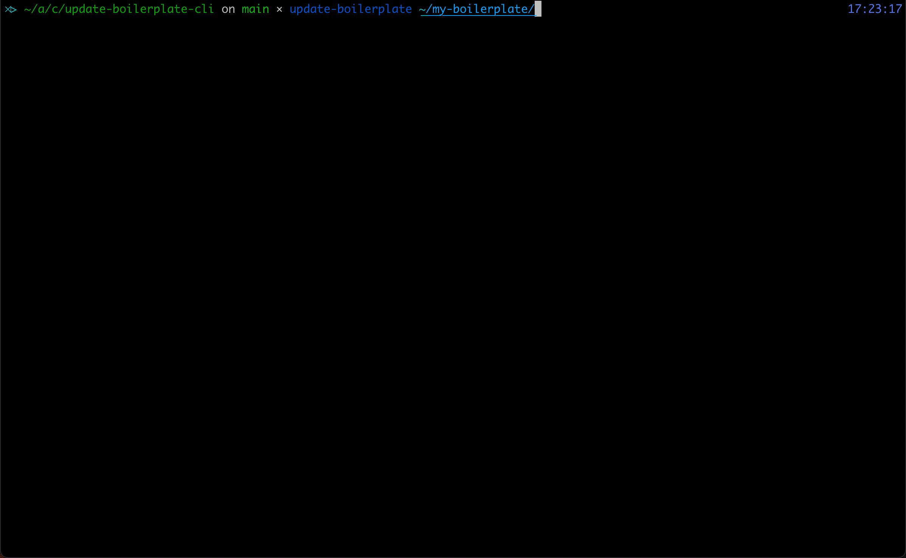

# update-boilerplate-cli

**CLI for updating projects to your latest boilerplate.** Works best for JavaScript setups, but can also be used with other ecosystems.

[](https://www.npmjs.com/package/update-boilerplate-cli)
[](license)
[](mailto:mail@juliustens.eu)



## Motivation

When you want to update your boilerplate code, e.g. because you  want to [switch from CommonJS to ES Modules]((https://gist.github.com/sindresorhus/a39789f98801d908bbc7ff3ecc99d99c#how-can-i-move-my-commonjs-project-to-esm)), synchronizing these changes to all of your projects can become annoying and error-prone quite quickly. Usually, you need to

- copy new dotfiles and config or update existing ones
- delete old dotfiles
- update scripts and other setup in your `package.json`
- update your code

This CLI can help you with the first three tasks. To be fair, you could also use `rsync`, but that becomes tedious when you then want to pick specific changes with `git add`s interactive/patch mode. Often, git cannot split changes to your `package.json` as granularily as you would like. This utility helps out by letting you decide exactly which files or properties (for JSON documents) you want to copy over.

## Installation

```sh
npm i -g update-boilerplate-cli
```

Or use it directly via `npx`.

## Usage

```sh
update-boilerplate --help
```

When installed globally via `npm`, the following will adapt your current working directory to the boilerplate in `~/my-boilerplate`
```sh
update-boilerplate ~/my-boilerplate
```

The same via `npx`:
```sh
npx update-boilerplate-cli ~/my-boilerplate
```

## Contributing

If you found a bug or want to propose a feature, feel free to visit [the issues page](https://github.com/juliuste/update-boilerplate-cli/issues).
